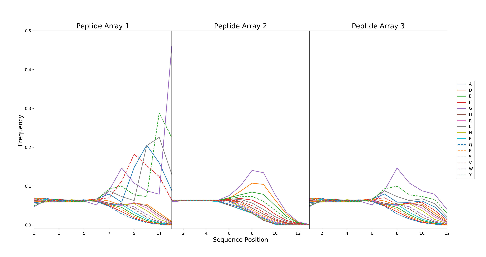

# peptide-array-ml
Neural network modeling of peptide sequence binding data

### Installation
1) Download and install the Python 3 version of Anaconda (https://www.anaconda.com/download/)
2) Install PyTorch with one of the following commands in a terminal/command prompt (https://pytorch.org):
   - Mac: `conda install pytorch torchvision -c pytorch`
   - Linux/Windows: `conda install pytorch torchvision cudatoolkit=10.0 -c pytorch`

### Script Usage
- `plot_distributions.py`: Plot length and amino acid distributions (Figures S_ and S_)

  
  

1Meiler, J.; Müller, M.; Zeidler, A.; Schmäschke, F. (2001) Generation and evaluation of dimension-reduced amino acid parameter representations by artificial neural networks. *Journal of Molecular Modeling*, 7, 360-369.